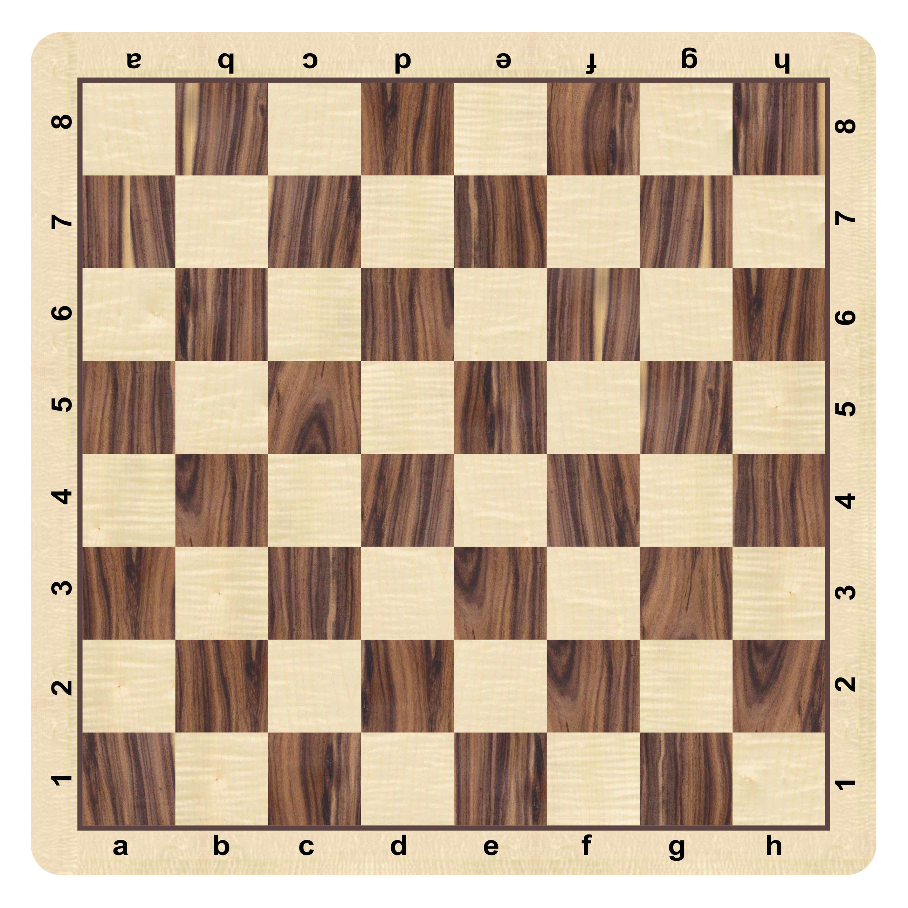

# Test Cases / Editorial


## 문제 1

[솔루션 (25/25점)](midterm-1.c)

5일 전으로부터 1일 전까지의 미세먼지 수치를 입력받습니다. 가중치를 각각 곱해서 합산해 다음 날의 미세먼지 수치를 예측하세요. 예측한 미세먼지 수치와 예측한 대기 상태를 나타내는 문자열을 뒤에 붙여 같이 출력할 것.

- 가중치

| 1일 전 | 2일 전 | 3일 전 | 4일 전 | 5일 전 |
| ------ | ------ | ------ | ------ | ------ |
| 0.50   | 0.25   | 0.15   | 0.06   | 0.04   |

- 대기 상태

| 30 미만 | 30 이상 80 미만 | 80 이상 150 미만 | 150 이상 |
| ------- | --------------- | ---------------- | -------- |
| good    | normal          | bad              | very bad |

### 에디토리얼

잘 곱해서 더하면 됩니다(포인터는 별 의미는 없는 거 같습니다).

주의해야 될 점은 `printBySelection`에서 `else` 브랜치를 사용할 수 없다는 점인데, 대신 논리 연산자를 이용해서 구현해야 합니다.

```c
if (weight_sum >= 150) {
	printf("%.2f very bad\n", weight_sum);
}
if (weight_sum >=  80 && weight_sum < 150) {
	printf("%.2f bad\n", weight_sum);
}
if (weight_sum >=  30 && weight_sum <  80) {
	printf("%.2f normal\n", weight_sum);
}
if (                     weight_sum <  30) {
	printf("%.2f good\n", weight_sum);
}
```

`float`을 소수점 아래 2자리까지 나오게 포매팅하는 문자열은 `"%.2f"`임을 기억하세요.


### 테스트 케이스

#### 1 in

```
125 20 10 0 80
```

#### 1 out

```
47.70 normal
```


#### 2 in

```
0 0 0 0 0
```

#### 2 out

```
0.00 good
```


#### 3 in

````
200 200 200 200 200
````

#### 3 out

```
200.00 very bad
```


#### 4 in

```
1 1 1 1 1
```

#### 4 out

```
1.00 good
```


#### 5 in

```
0 29 79 149 1000
```

#### 5 out

```
550.84 very bad
```


## 문제 2

[솔루션 (25/25점)](midterm-2.c)



체스판의 한 칸의 행과 열을 입력받습니다. 해당 칸이 흰색인지 검은색인지 판별하세요.


### 에디토리얼

a에서 h까지도 1에서 8까지로 생각한다면 열의 숫자와 행의 숫자를 더한 게 홀수일 때 흰색, 짝수일 때 검은색임을 알 수 있습니다. `int`형과 `char`형이 쉽게 변환됨을 이용해 문자로 받은 행을 정수로 바꿔버릴 수 있습니다.

```c
int _col = col - 0x60; // 'a' = 0x61
```

`'a'`가 `0x61`이라는 사실을 몰라도 쉽게 풀 수 있지만 `0`은 `0x30`, `A`는 `0x41`, `a`는 `0x61`임을 기억해 두면 생각보다 쓸 데가 많습니다.


### 테스트 케이스

#### 1 in

```
g6
```

#### 1 out

```
B
```


#### 2 in

```
h8
```

#### 2 out

```
B
```


#### 3 in

```
a1
```

#### 3 out

```
B
```


## 문제 3

[솔루션 (25/25점)](midterm-3.c)

카이사르 암호는 간단한 치환암호의 일종입니다. 암호화하고자 하는 내용을 알파벳별로 일정한 거리만큼 밀어서 다른 알파벳으로 치환하는 방식입니다. 거리와 3글자의 문자열을 받아 암호화된 문자열을 출력하세요. 입력은 소문자로만 들어옵니다.


### 에디토리얼

`key`가 0~25만 들어오는 게 아니라는 것에 유의합니다. 문자에서 `0x61`(`'a'`)를 빼 줘 `'a'` = 0, `'b'` = 1, ..., `'z'` = 25로 만들고 `key`를 더해준 후 26으로 나눈 나머지를 구합니다.

```c
int alphabetIndex = *alphabet - 0x61;

alphabetIndex += key;
alphabetIndex %= 26;
```

음수가 되었을 때 나머지는 음수이지만 (-25, -1) 사이에 떨어지므로, 혹시 나머지가 음수가 나왔다면 26을 더해 줍니다.

```c
if (alphabetIndex < 0) alphabetIndex += 26;
```

마지막으로 다시 `0x61`(`'a'`)를 더해 주면 문자가 카이사르 암호화됩니다.


### 테스트 케이스

#### 1 in

```
2 aaa
```

#### 1 out

```
ccc
```


#### 2 in

```
-1 aaa
```

#### 2 out

```
zzz
```


## 문제 4

[솔루션 (25/25점)](midterm-4.c)

어느 도로에 감시 카메라가 4대 설치되어 있습니다. 카메라에서 영상 정보를 수신하기 위해 카메라와 카메라 사이 중점에 수신기를 2대 설치하려고 합니다. 수신기는 이웃한 카메라에서만 정보를 수신할 수 있습니다. 카메라와 수신기 사이에는 통신 비용이 있는데 이 비용을 최소화하고 싶습니다. 카메라의 좌표가 증가하는 순서대로 주어질 때 수신기가 정보를 수집 가능한 거리의 합을 계산하세요.


### 에디토리얼

쉬운 그리디 알고리즘입니다. 문제를 이해하기가 쉽지 않지만 이해한다면, 카메라와 카메라 사이의 간격이 각각 `a`, `b`, `c`일 때, 이 중 작은 순서대로 2개를 더하면 되는 문제입니다. 이미 카메라가 좌표 순서대로 들어오므로 정렬을 할 필요는 없습니다.

Nested `if`를 쓸 수 없으므로 `a`가 최대, `b`가 최대, `c`가 최대일 때를 각각 논리 연산자로 계산하여 경우를 나눠야 합니다.

```c
float sum = 0;
if (a >= b && a >= c) sum = b + c; // a is maximum
if (b >= a && b >= c) sum = c + a; // b is maximum
if (c >= a && c >= b) sum = a + b; // c is maximum

return sum;
```

혹은 전체 거리를 계산한 뒤 전체 거리에서 최댓값을 빼 줘도 됩니다.

맞게 짠 코드이더라도 값이 잘못되어 보일 수 있습니다. 가령 테스트 케이스 1의 `-4.3 1.7 3.1 5.0`을 입력하면 `3.3` 대신 `3.299999`가 나올 수 있습니다. floating-point mathematics가 다 그런 것입니다. 따라서 문제의 조건에는 나와 있지 않지만, 소수점 아래 한 자리수까지만 출력해야 합니다.

```c
printf("%.1f\n", check(c1, c2, c3, c4));
```


### 테스트 케이스

#### 1 in

```
-4.3 1.7 3.1 5.0
```

#### 1 out

```
3.3
```


#### 2 in

```
-5.0 -4.3 -4.0 -3.9
```

#### 2 out

```
0.4
```


#### 3 in

```
0.2 0.3 0.4 0.5
```

#### 3 out

```
0.2
```


#### 4 in

```
-4.0 0.0 2.0 3.0
```

#### 4 out

```
3.0
```


#### 5 in

```
-5.0 0.0 1.0 5.0
```

#### 5 out

```
5.0
```

